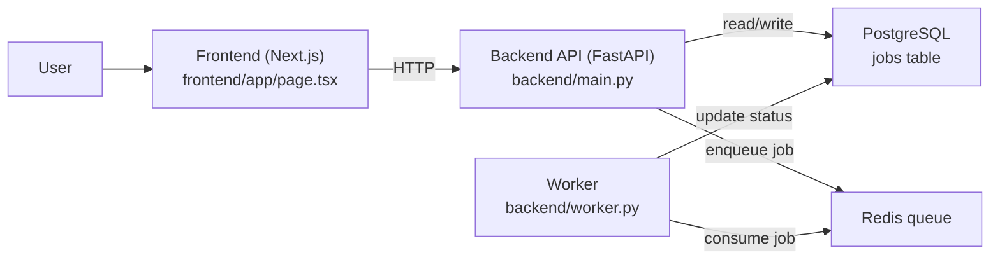
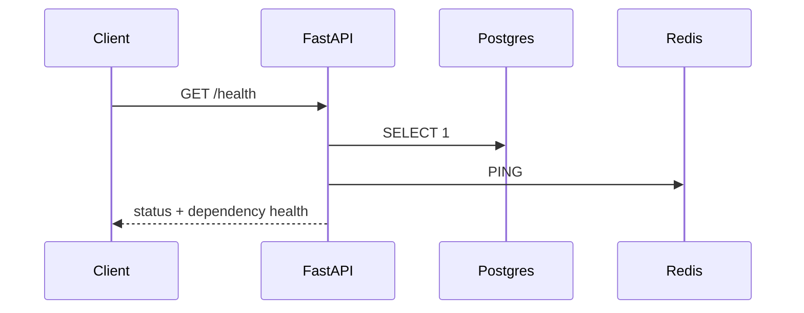
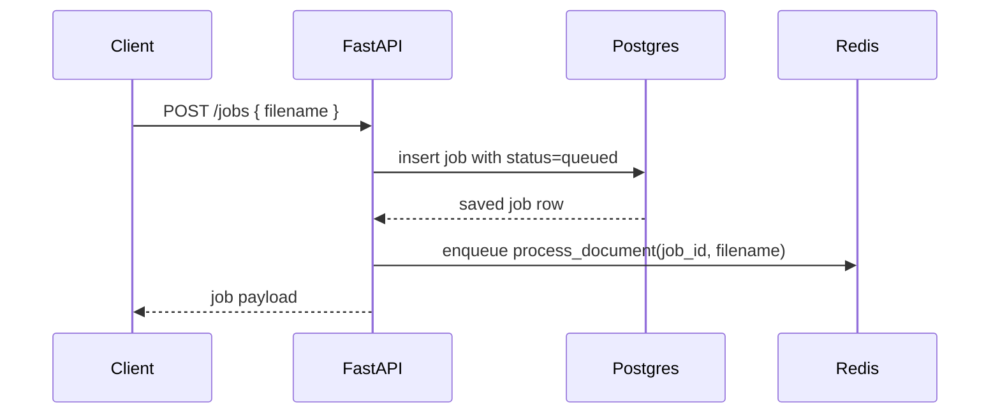
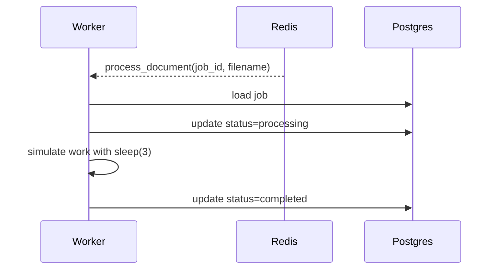
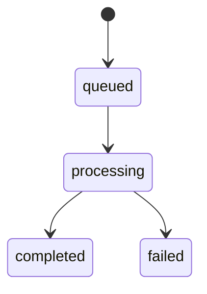

# Pulse App Flow

This document maps the app as it exists today, not as it is planned to become.

## 1. High-Level Architecture

## 2. What the Frontend Does Today

The frontend is currently only a placeholder screen.

- Entry page: `frontend/app/page.tsx`
- Current behavior: render "This will be our dashboard!"
- Current limitation: it does not call the backend yet

That means the real application flow today starts at the backend API, not in the browser UI.

## 3. Main Backend Flow

### A. Health check

Purpose:
- Confirms the API is running.
- Confirms database connectivity.
- Confirms Redis connectivity.

Code:
- `backend/main.py` `health()`

### B. Create job

Step-by-step:
1. Client sends a filename to `POST /jobs`.
2. FastAPI creates a `Job` row.
3. The row is stored in Postgres with default status `queued`.
4. The API enqueues background work in Redis.
5. The API returns the created job immediately.

Why this matters:
- The request stays fast because document work is deferred.
- The database becomes the source of truth for job status.

Code:
- Request schema: `backend/schemas.py`
- Data model: `backend/models.py`
- Endpoint: `backend/main.py` `create_job()`

### C. Worker processes job

Step-by-step:
1. Worker receives a queued job from Redis.
2. Worker loads the matching `Job` row from Postgres.
3. Worker marks it `processing`.
4. Worker performs placeholder work.
5. Worker marks it `completed`.
6. If an exception happens after the job is loaded, worker marks it `failed`.

Code:
- Worker entrypoint: `backend/worker.py`
- Status enum: `backend/models.py`

## 4. Job State Machine

Statuses defined today:
- `queued`
- `processing`
- `completed`
- `failed`

## 5. Runtime Components

From `docker-compose.yml`, the app currently starts:
- `frontend`
- `backend`
- `db`
- `redis`

Operational meaning:
- `frontend` serves the UI
- `backend` exposes the API on port `8000`
- `db` stores persistent job data
- `redis` acts as the queue broker

## 6. Important Gaps in the Current Flow

These are important because they affect how the app behaves in practice.

### Gap 1. No worker service in Docker Compose

The intended async flow requires a running worker, but `docker-compose.yml` does not start one.

Effect:
- `POST /jobs` can create a job
- but nothing will consume the queued work unless the worker is launched separately

### Gap 2. Redis queue host is hardcoded to `localhost`

Both:
- `backend/main.py`
- `backend/worker.py`

create ARQ Redis settings with `host="localhost"`.

Inside Docker, `localhost` points to the container itself, not the `redis` service.

Effect:
- health checks may succeed because `redis_client` uses `settings.redis_url`
- but queue enqueue/consume can still fail because ARQ is configured differently

### Gap 3. Frontend is not wired into the API yet

The browser UI does not currently:
- create jobs
- list jobs
- poll for status
- visualize progress

So the architectural flow exists mostly in the backend right now.

## 7. How to Read the Code in the Best Order

If your goal is to learn how the app works, read it in this sequence:

1. `backend/models.py`
   Understand the `Job` entity and status lifecycle.
2. `backend/schemas.py`
   Understand what the API accepts and returns.
3. `backend/main.py`
   Understand request handling and job creation.
4. `backend/worker.py`
   Understand asynchronous processing and status transitions.
5. `docker-compose.yml`
   Understand how services are expected to run together.
6. `frontend/app/page.tsx`
   Confirm that the UI is still a placeholder.

## 8. Mental Model

The app is currently a job-processing system with a very thin UI.

The core idea is:
- accept a request
- persist a job record
- queue background work
- let a worker update job state over time
- later, show that state in the frontend

That is the main app flow to keep in your head while you read the code.
